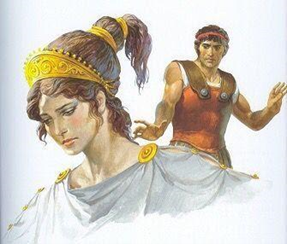

# Didone Innamorata

[[toc]]

## Riassunto

Dopo aver perso il padre in Sicilia, Enea giunge a Cartagine dove viene accolto dalla regina Didone.
Ella, ascoltando i racconti degli intrepidi viaggi di Enea, si infatua dell’eroe.
Decide quindi di confidare i propri sentimenti e dubbi alla sorella Anna, che le consiglia di arrendersi all’amore e tradire la promessa fatta al marito defunto.

## Struttura del testo

* *L'indicibile amore di Didone*
  Da riga 1 *[Ma la regina…]* a riga 5 *[…il riposo che placa.]*
* *Didone si confida ad Anna*
  Da riga 6 *[Con il seguente…]* a riga 30 *[…ne riempì il seno.]*
* *La speranza sopraggiunta a Didone*
  Da riga 31 *[Anna risponde…]* a riga 53 *[…e intrattabile è il cielo.]*
* *Il consenso degli Dei*
  Da riga 54 *[Questo dicendo…]* a riga 73 *[…foriera di morte.]*
* *La città paralizzata da un addio*
  Da riga 74 *[Ora con sé…]* a riga 89 *[…portati su al cielo.]*

## Commento del brano

### Personaggi

* **Didone** è la fondatrice e la regina di Cartagine; accoglie Enea e si innamora perdutamente di lui. Nel brano si denota un senso di colpa dovuto alla promessa di fedeltà fatta al defunto marito Sicheo (riga 15-22: *se non avessi…che ora vacilla l’animo*); Didone viene descritta come una donna affascinante viste le numerose proposte di matrimonio da lei rifiutate (r.35-36: *nessun pretendente ti ha mai piegato…e anche gli altri*).
* **Enea** è il protagonista principale di tutta l’opera, il quale viene descritto come un guerriero valoroso legato alla propria patria e che ha affrontato molte battaglie. I suoi racconti mitici lo rendevano affascinante e per questo suscitavano l’interesse di Didone e di molte altre donne (r.79: *e pende di nuovo dal labbro di Enea che racconta*).
* **Anna** è la sorella di Didone, che in questo brano assume un ruolo veramente molto rilevante, in quanto cerca di far cambiare idea alla regina, facendole capire che sposare Enea, avrebbe portato a dei vantaggi, tra cui la protezione del suo esercito contro le altre popolazioni nemiche (r. 39-49: *Qui le citta dei Getuli…la gloria dei Punici!*)
* **Sichèo** era il marito defunto di Didone, al quale aveva giurato fedeltà e amore eterno (r.28: *Quello, colui…nel sepolcro li serbi!*)
* **Pigmalione**, fratello di Didone, uccise Sichèo per assumere il potere di Tiro. Nel racconto viene nominato più volte come nemico della regina cartaginese. (r.43-44: *E a che ricordate…minacce del fratello?*)

### Temi

Questo brano si basa principalmente sui rapporti e i sentimenti tra i personaggi.
Il modo in cui Didone si confida con la sorella fa intendere il legame intenso di amicizia che c’è tra loro e che riesce ad andare oltre al tipico rapporto tra sorelle, infatti sono importanti l’una per l’altra (r. 31: *O alla tua sorella più cara del sole*).
Didone è molto legata, ma soprattutto devota, anche al defunto marito e non vuole mancare alla promessa di fedeltà fatta (r. 15-17: *se non avessi nell’animo...mi illuse e deluse*), dimostrandosi molto decisa nel rispettarla (r.28-29: *quello, colui…nel sepolcro li serbi*). 
Inoltre, prova un senso di colpa per essersi innamorata dell’eroe troiano (r. 20-23: *lo confesso Anna… vacilla, l’animo*), e dimostra di provare un sentimento ostile per il fratello, causa della morte del marito (r. 21: *e dalla strage fraterna che asperse i Penati*) e delle minacce verso il suo popolo (r.43-44: *e a che ricordare…le minacce del fratello*).
Il rapporto che ha con Enea sottolinea l’amore che la regina prova per l’eroe, ma che al tempo stesso non vorrebbe provare (r.38: *ma muoverai guerra perfino a un amore gradito?*); questa unione poteva inoltre essere vantaggiosa, da un punto di vista politico, in quanto Enea l’avrebbe protetta dai pretendenti che un tempo, aveva respinto (r.39: *né ti ritorna in mente nei campi di chi hai posato sede?*).

### Tempo e spazio

La durata del brano è di una giornata intera, inizia all’alba dopo la notte insonne di Didone (r. 5-7: *né il tormento…l’umida ombra dal cielo*) e si conclude con l’arrivo del nuovo giorno (r. 81: *la luna… al declino*).
Principalmente il brano è raccontato al presente e al passato e non sono presenti molti avverbi di tempo.
Il brano è ambientato nelle stanze del palazzo reale (si presuppone che il dialogo tra le due sorelle avvenga nella stanza da letto di Didone, dopo il risveglio della regina; r.82: *sola si strugge nei vuoti di casa e si adagia sui drappi ora lasciati*) e tra le strade di Cartagine (r.68-69: *l’infelice Didone arde…per la città*; r.74-75: *ora con sé fra le mura…quasi pronta*).
Vengono citati inoltre i luoghi natali dei personaggi come Tiro (città da cui proviene Didone), Libia e Africa (da cui provengono i pretendenti).

## *Made by Cescon Stella, Santin Giulia, Canal Elisa, Zanette Martina*
