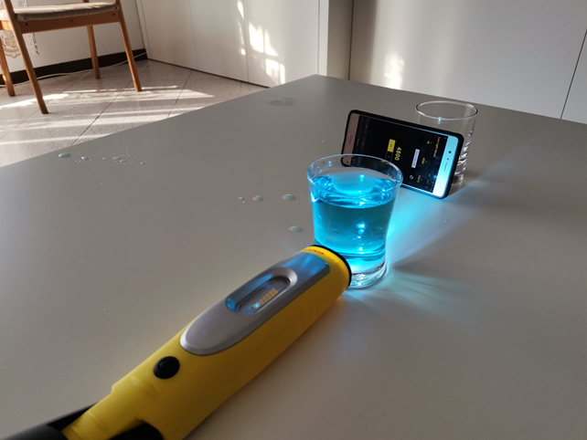
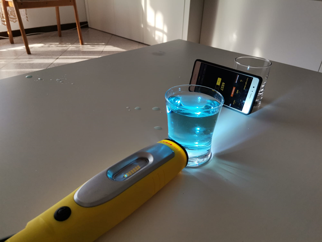
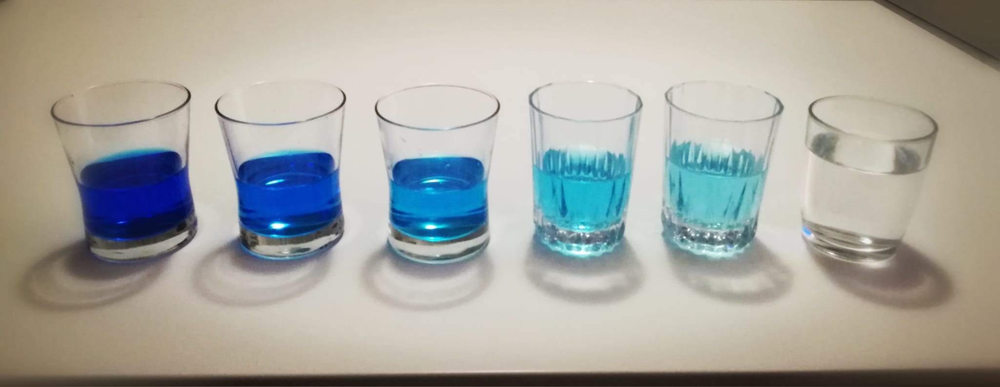

# Interazione luce materia

## Obiettivo

L’obiettivo di questo esperimento è osservare la relazione tra l'intensità del colore di 4 soluzioni a diversa diluizione e il valore in LUX misurati con l'app lux meter.

## Materiali

- 6 recipienti trasparenti
- Colorante (preferibilmente blu)
- Acqua (preferibilmente distillata)
- Pipetta
- Superficie bianca (per fare le osservazioni)
- Torcia
- Telefono
  - app per leggere i LUX
- Pennarello

## Procedimento

1. Porre tutti i materiali sulla superficie vianca e prendere il primo recipiente
2. Segnare il volume massimo e la metà di esso in ogni bicchiere
3. Preparare la soluzione madre nel primo recipiente aggiungendo 10 goccie di colorante con la pipetta
4. Ora portare a volume aggiungendo acqua  
5. Adesso bisogna prendere metà della soluzione madre appena preparata e passarla sul secondo recipiente. Successivamente portare a volume così da ottenere una soluzione più diluita
6. Ripetere l'operazione per tutti i bicchieri tranne l'ultimo nel quale bisogna disporre solo acqua
7. Ora porre ciascun recipiente tra il telefono e la torcia (puntata sul bicchiere) e raccogliere i dati.
8. Posizionare i contenitori dalla soluzione madre alla più diluita (acqua) ed osservare.

## Foto esperimento

| **Foto soluzioni** |
|---------------------|
| **Soluzione madre** |
|  |
| **Soluzione diluita 1/2** |
|  |
| **Soluzione diluita 1/4** |
|  |
| **Soluzione diluita 1/8** |
|  |
| **Soluzione diluita 1/16** |
|  |
| **Recipiente con acqua** |
|  |

## Foto recipienti

## Raccolta ed elaborazione dati

| Diluizione | Numero LUX | Incremento |
|------------|------------|------------|
| *Soluzione madre* | 1071 | Partenza |
| *Diluizione 1/2* | 2216 | + 1145 LUX |
| *Diluizione 1/4* | 3459 | + 1243 LUX |
| *Diluizione 1/8* | 4800 | + 1342 LUX |
| *Diluizione 1/16* | 6037 | + 1237 LUX |
| *Recipiente con acqua* | 7201 | + 1164 LUX |

- La media dell’incremento dei valori del LUX corrisponde alla somma di tutti i valori di incremento diviso il numero di recipienti tranne la soluzione madre --&gt; (1145 LUX+ 1243 LUX + 1342 LUX + 1237 LUX + 1164 LUX + 1254LUX) / 6 = *1231* LUX

### Tabella dei dati

## Conclusione

Dai risultati sperimentali si osserva che più la soluzione è concentrata, minore è l'intensità luminosa letta dall'app. Si può inoltre osservare che la concentrazione di una sostanza colorata è inversamente proporzionale al valore dell'intensità luminosa che riesce ad attraversare la soluzione. Questo metodo correttamente standardizzato potrebbe essere una tecnica analitica per determinare la concentrazione delle soluzioni.
