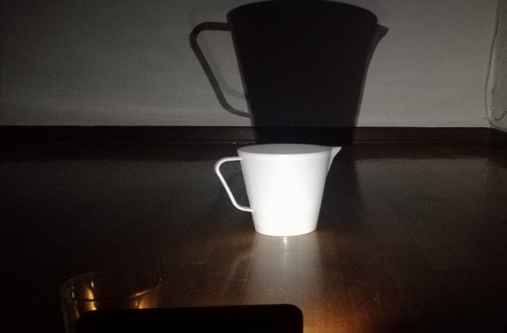
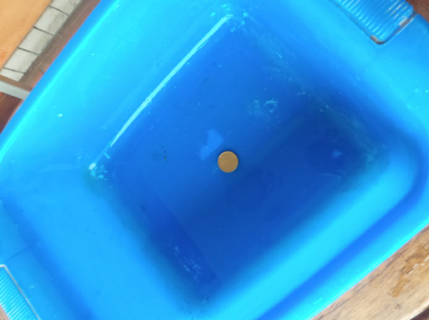

## Come si propaga la luce?

### Obiettivo

L’obiettivo di questo esperimento è analizzare il comportamento della luce.

### Materiali

- Sorgente luminosa (torcia)
- Tre cartoncini scuri (dimensioni: circa 15x20)
- Mollette
- Schermo parete

### Procedimento

1. Forare due cartoncini alla stessa altezza.
2. Disporre verticalmente i cartoncini con le mollette e allinearli davanti ad uno schermo/ parete (al buio), in modo che puntando la luce sui fori essa arrivi sullo schermo.
3. Successivamente porre il terzo cartoncino tra i primi due cartoncini e lo schermo, verificando cosa accade. 
4. Forare il terzo cartoncino in modo che allineandolo con gli altri due, la luce raggiunga la parete.

### Osservazioni

Illuminando i fori quando sono presenti solo due cartoncini, noto che la luce emessa dalla torcia attraversa entrambi i buchi effettuati fino ad arrivare allo schermo/parete. La luce sulla parete ha una forma circolare, congruente con il foro del secondo cartoncino (quello più vicino allo schermo).

Quando pongo, tra i due cartoncini forati, il terzo, non forato, noto che la luce non raggiunge più la parete né il foro del secondo cartoncino, poiché viene “fermata” da quest’ultimo. Osservo anche che la luce, quando arriva al terzo cartoncino che la blocca, possiede una forma e delle dimensioni identiche a quelle del foro del primo cartoncino.

### Conclusioni

Affinché sia possibile vedere la luce sulla parete, bisogna disporre i tre cartoncini in modo parallelo tra loro e assicurarsi che i loro fori siano disposti lungo la stessa retta (sulla quale deve essere presente, prima dei cartoncini, anche la sorgente luminosa), poiché i fotoni (le particelle che compongono la luce) si propagano nello spazio in linea retta.

Il terzo cartoncino, quando posto tra gli altri due, “blocca” la luce perché è un corpo opaco, quindi i fotoni non riescono ad attraversarlo.

## Le Ombre

### Obiettivo

Lo scopo del seguente esperimento è comprendere perché si formano ombra e penombra.

### Materiali

- Corpo opaco
- Corpo traslucido
- Corpo trasparente
- Sorgente luminosa (torcia)
- Stanza buia

### Procedimento

1. Illuminare il corpo trasparente con la torcia.
2. Ripetere l’operazione con l’oggetto traslucido.
3. Illuminare il corpo opaco tenendo la torcia lontana dall’oggetto.
4. Rilluminare il corpo opaco, diminuendo la distanza tra oggetto e torcia.

### Osservazioni 

Illuminando i vari oggetti con la torcia, osservo notevoli differenze nella loro ombra.

L’ombra del corpo trasparente (bicchiere) è quasi inesistente: appare fievole, in alcuni punti quasi sembra che non ci sia.

L’ombra del corpo traslucido è ben evidente sulla parete.

Nonostante ciò non tutta la luce viene bloccata dal corpo traslucido, ma alcuni fotoni lo attraversano. Posso riscontrare ciò osservando che, ponendo dietro al corpo traslucido un altro corpo opaco (pennarello), posso notare l’ombra di quest’ultimo, provocata dai fotoni che attraversano la coppetta.

L’ombra del corpo opaco cambia in base alla distanza della fonte luminosa dall’oggetto. Se la torcia è lontana, si può riscontrare un’ombra ben definita sulla parete, poiché il corpo blocca tutti i fotoni.

Nel caso in cui invece oggetto e torcia sono vicini, si può notare come, tra l’ombra dell’oggetto e la parte di parete illuminata, ci sia una piccola zona di ombra più chiara, la penombra.
*Di seguito una foto ingrandita dove è possibile vedere la penombra tra la zona ben illuminata e l’ombra.*

### Conclusioni
L’ombra si forma perché l’oggetto non lascia passare nessun fotone proveniente dalla torcia, formando così sul muro una zona non illuminata.

La penombra (visibile quando si illumina un oggetto opaco e la sorgente luminosa si trova vicino al corpo) è la zona parzialmente illuminata che si trova tra l’area completamente in ombra e lo spazio illuminato. Si forma perché, a causa della ridotta distanza tra corpo e fonte di luce, in quest’area alcuni fotoni non vengono fermati dall’oggetto, andando a creare questa zona parzialmente illuminata.

## La rifrazione

### Obiettivo

L’obiettivo di questo esperimento è analizzare il fenomeno della rifrazione.

### Materiali

- Matita o cannuccia
- Moneta
- Bicchiere trasparente
- Bacinella
- Acqua

### Procedimento

1. Mettere la matita nel bicchiere
2. Riempire il bicchiere d’acqua fino a metà

3. Prendere la bacinella vuota e porre sul fondo una moneta

4. Guardare il bordo della bacinella, facendo in modo la moneta sia fuori dal campo visivo

5. Riempire la bacinella e osservare dallo stesso punto di vista

### Osservazioni

Noto che la matita, nella sua parte immersa, appare piegata e più grande rispetto alla sua parte emersa, reale. Osservo inoltre che non c’è una completa continuità tra i bordi dell’oggetto: la parte immersa sembra leggermente “spostata”, come se fosse collegata parzialmente al resto del mezzo.

Quando riempio d’acqua la bacinella, guardando dall’altezza del bordo del contenitore, anche se la moneta è fuori dal mio campo visivo, riesco a vederla sott’acqua, come se fosse appena sotto la superficie del liquido.

### Conclusioni

La matita appare piegata a causa della rifrazione, un fenomeno fisico che avviene quando dei fotoni attraversano la superficie di separazione tra due corpi nei quali la velocità della luce è differente. Quando queste condizioni si avverano, i raggi luminosi cambiano inclinazione e l’immagine appare “storta”, con inclinazione diversa rispetto alla realtà.

Sempre a causa della rifrazione l’inclinazione dei raggi di luce passando dall’acqua nella bacinella all’aria subiscono una modifica della loro inclinazione: poiché l’acqua ha un indice di rifrazione (1,33) maggiore di quello dell’aria (1), l’inclinazione aumenta e i fotoni si allontanano dalla normale dalla normale (retta immaginaria perpendicolare alla superficie di separazione) e avvicinandosi progressivamente alla superficie del liquido, diventando radenti alla superficie e per questo, con l’occhio al livello del bordo della bacinella, si riesce a vedere la moneta, cosa che sarebbe stata impossibile se la bacinella fosse stata vuota.
