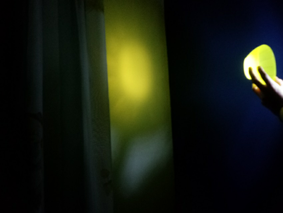
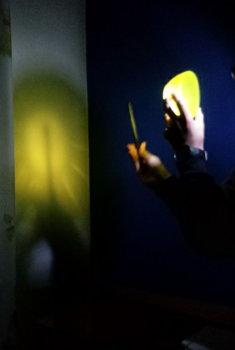

# Le Ombre

## Obiettivo

Lo scopo del seguente esperimento è comprendere perché si formano ombra e penombra.

## Materiali

- Corpo opaco
- Corpo traslucido
- Corpo trasparente
- Sorgente luminosa (torcia)
- Stanza buia

## Procedimento

1. Illuminare il corpo trasparente con la torcia.
2. Ripetere l’operazione con l’oggetto traslucido.
3. Illuminare il corpo opaco tenendo la torcia lontana dall’oggetto.
4. Rilluminare il corpo opaco, diminuendo la distanza tra oggetto e torcia.

## Osservazioni

Illuminando i vari oggetti con la torcia, osservo notevoli differenze nella loro ombra.

L’ombra del corpo trasparente (bicchiere) è quasi inesistente: appare fievole, in alcuni punti quasi sembra che non ci sia.

L’ombra del corpo traslucido è ben evidente sulla parete.

Nonostante ciò non tutta la luce viene bloccata dal corpo traslucido, ma alcuni fotoni lo attraversano. Posso riscontrare ciò osservando che, ponendo dietro al corpo traslucido un altro corpo opaco (pennarello), posso notare l’ombra di quest’ultimo, provocata dai fotoni che attraversano la coppetta.

L’ombra del corpo opaco cambia in base alla distanza della fonte luminosa dall’oggetto. Se la torcia è lontana, si può riscontrare un’ombra ben definita sulla parete, poiché il corpo blocca tutti i fotoni.

Nel caso in cui invece oggetto e torcia sono vicini, si può notare come, tra l’ombra dell’oggetto e la parte di parete illuminata, ci sia una piccola zona di ombra più chiara, la penombra.
*Di seguito una foto ingrandita dove è possibile vedere la penombra tra la zona ben illuminata e l’ombra.*

## Conclusioni

L’ombra si forma perché l’oggetto non lascia passare nessun fotone proveniente dalla torcia, formando così sul muro una zona non illuminata.

La penombra (visibile quando si illumina un oggetto opaco e la sorgente luminosa si trova vicino al corpo) è la zona parzialmente illuminata che si trova tra l’area completamente in ombra e lo spazio illuminato. Si forma perché, a causa della ridotta distanza tra corpo e fonte di luce, in quest’area alcuni fotoni non vengono fermati dall’oggetto, andando a creare questa zona parzialmente illuminata.
