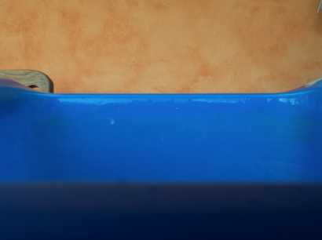

# La rifrazione

## Obiettivo

L’obiettivo di questo esperimento è analizzare il fenomeno della rifrazione.

## Materiali

- Matita o cannuccia
- Moneta
- Bicchiere trasparente
- Bacinella
- Acqua

## Procedimento

1. Mettere la matita nel bicchiere
2. Riempire il bicchiere d’acqua fino a metà
3. Prendere la bacinella vuota e porre sul fondo una moneta
4. Guardare il bordo della bacinella, facendo in modo la moneta sia fuori dal campo visivo
5. Riempire la bacinella e osservare dallo stesso punto di vista
6. Osservare e raccogliere informazioni

## Foto esperimento

## Osservazioni

Noto che la matita, nella sua parte immersa, appare piegata e più grande rispetto alla sua parte emersa, reale. Osservo inoltre che non c’è una completa continuità tra i bordi dell’oggetto: la parte immersa sembra leggermente “spostata”, come se fosse collegata parzialmente al resto del mezzo.
Quando riempio d’acqua la bacinella, guardando dall’altezza del bordo del contenitore, anche se la moneta è fuori dal mio campo visivo, riesco a vederla sott’acqua, come se fosse appena sotto la superficie del liquido.

## Conclusioni

La matita appare piegata a causa della rifrazione, un fenomeno fisico che avviene quando dei fotoni attraversano la superficie di separazione tra due corpi nei quali la velocità della luce è differente. Quando queste condizioni si avverano, i raggi luminosi cambiano inclinazione e l’immagine appare “storta”, con inclinazione diversa rispetto alla realtà.
Sempre a causa della rifrazione l’inclinazione dei raggi di luce passando dall’acqua nella bacinella all’aria subiscono una modifica della loro inclinazione: poiché l’acqua ha un indice di rifrazione (1,33) maggiore di quello dell’aria (1), l’inclinazione aumenta e i fotoni si allontanano dalla normale dalla normale (retta immaginaria perpendicolare alla superficie di separazione) e avvicinandosi progressivamente alla superficie del liquido, diventando radenti alla superficie e per questo, con l’occhio al livello del bordo della bacinella, si riesce a vedere la moneta, cosa che sarebbe stata impossibile se la bacinella fosse stata vuota.
